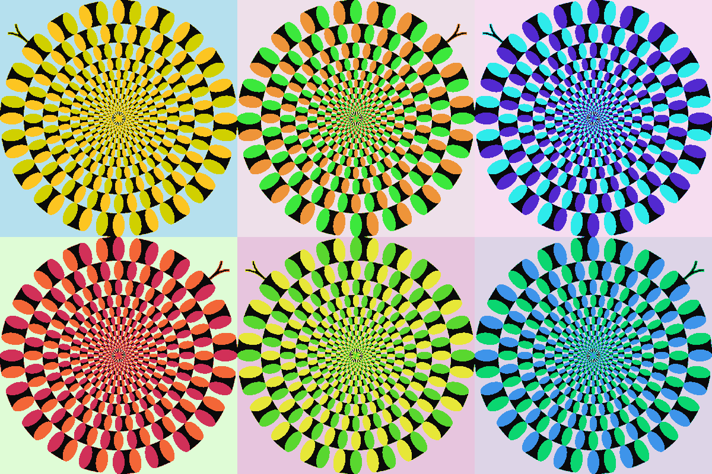
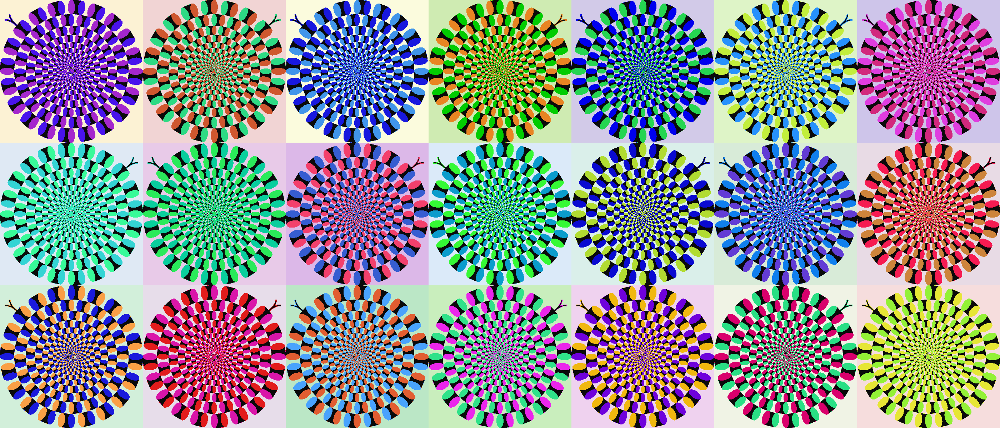

# "Rotating Snakes" Pop Art Generator

A Python tool that transforms a visual illusion ("Rotating Snakes" Illusion created by Prof. Akiyoshi Kitaoka) image into a pop art composition (inspired by Andy Warhol's grid-based works). Each run produces a unique piece with fully randomized color palettes.



## Background

The input image (`RS.jpg`) is a variant of the **"Rotating Snakes" illusion** (created by Prof. Akiyoshi Kitaoka), a motion illusion in which stationary patterns appear to rotate. The script takes this illusion as a base tile, generates color-remapped variants and their horizontal mirror images, then arranges them in a checkerboard grid, creating an artwork that is both visually striking and perceptually active.

Each cell in the grid uses an independently randomized color palette, so no two cells share the same colors. The alternating original / mirror layout reinforces the rhythmic visual tension of the illusion.

## Requirements

```
Pillow
numpy
```

Install with:

```bash
pip install Pillow numpy
```

## Usage

Place `RS.jpg` (or your own source image) in the same directory as the script, then run:

```bash
python3 pop_art_illusion.py
or
python pop_art_illusion.py
```

Output is saved to the current directory as `pop_art_YYYYMMDD_HHMMSS.png`. A new unique filename is generated on every run.

## Options

| Option | Default | Description |
|--------|---------|-------------|
| `--input` | `RS.jpg` | Source image path |
| `--output` | auto (timestamped) | Output file path |
| `--cols` | `3` | Number of columns |
| `--rows` | `2` | Number of rows |
| `--size` | `400` | Cell size in pixels |
| `--border` | `0` | Gap between cells in pixels (0 = seamless) |
| `--bg` | `white` | Gap/background color: `white`, `black`, or `#RRGGBB` |
| `--seed` | random | Random seed (omit for a new result every run) |

## Examples

```bash
# Default 3×2 grid, seamless, white background
python3 pop_art_illusion.py

# Larger 4×3 grid with a dark gap
python3 pop_art_illusion.py --cols 4 --rows 3 --border 20 --bg black

# Single row of 5, custom accent color between cells
python3 pop_art_illusion.py --cols 5 --rows 1 --border 10 --bg "#ff6600"

# High-resolution output for large-format printing (A0-ready)
python3 pop_art_illusion.py --size 1200

# Reproduce a specific result
python3 pop_art_illusion.py --seed 1784664794
```

## How It Works

1. **Color analysis** — The script detects the four key colors in the source image (white, black, and two accent colors) using brightness thresholds and RGB channel ratios.
2. **Palette generation** — For each cell, a new random palette is generated by sampling well-separated hues from HSV color space, ensuring vivid, pop-art-style results.
3. **Color remapping** — Every pixel is assigned to its nearest original color via squared Euclidean distance, then substituted with the new palette color.
4. **Mirror tiling** — Odd-indexed cells (by checkerboard position) use the horizontally flipped version of the remapped image, creating a seamless alternating rhythm across the grid.
5. **Randomized layout** — Both the color variants and their grid positions are shuffled independently on every run.

## Reproducibility

Every run prints the random seed used:

```
Random seed: 1784664794  (to reproduce, use --seed 1784664794)
```

Pass that seed back with `--seed` to reproduce the exact same output.

## Author

Eiji Watanabe   
National Institute for Basic Biology, Japan

## Enjoy !!!


